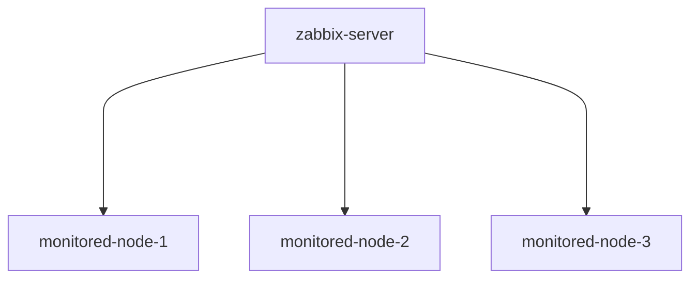

# ZABBIX CLUSTER SIMULATION

zabbix monitored node simulation for personal playground and training

## ARCHITECTURE

the simulation creates a vagrant network monitored from a central zabbix node in order to play around and explore zabbix monitoring solution



## INSTALLATION

- install [vagrant](https://www.vagrantup.com/) and [virtualbox](https://www.virtualbox.org/)

- create python venv and install dependencies

```bash
cd edgex_iot_simulation
python -m venv env 
source env/bin/activate
pip install -r requirements.txt
```

- install geerlingguy.mysql geerlingguy.php geerlingguy.apache roles and community.zabbix collection

```bash
source env/bin/activate
ansible-galaxy role install geeringguy.mysql
ansible-galaxy role install geeringguy.apache
ansible-galaxy role install geeringguy.php
ansible-galaxy collection install community.zabbix
```

- start cluster

```bash
vagrant up
```

- run the preflight.yml playbook, this will install the zabbix server and web interface and enable snmp on the monitored node

```bash
ansible-playbook -i inventory.yml preflight.yml
```
